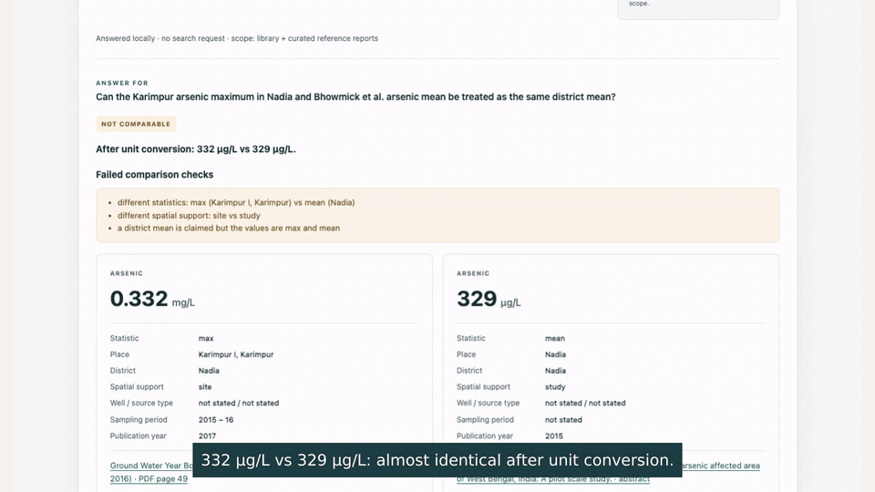
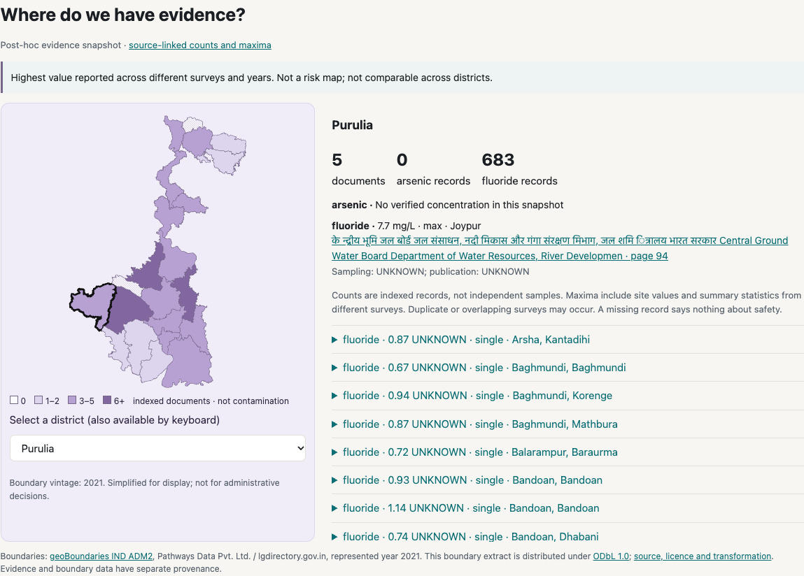

# NeerTathya

**Ask about groundwater arsenic or fluoride in West Bengal. Get the exact number with its document, page and table row, or a reasoned refusal when the evidence cannot support the question.**

**[Ask it in your browser](https://mohitt31.github.io/jaldrishti/#ask)** · **[District evidence map](https://mohitt31.github.io/jaldrishti/#map)** · **[Demo video (2:13)](https://mohitt31.github.io/jaldrishti/demo.html)** · Track: Knowledge & Public Interest

**60-second check, no install:** open [Ask](https://mohitt31.github.io/jaldrishti/#ask), click **332 vs 329 µg/L: comparable?** (Python loads once; the first answer takes a few seconds), and read the failed checks; then click **A measured value** and follow its PDF page link. Questions run in your browser and make no new searches.

West Bengal has some of the world's worst groundwater arsenic, and parts of the state have high fluoride. The measurements exist, but they sit in annexure tables of 100–270 page government reports and in paper abstracts. A search engine finds pages *about* arsenic; it does not hand you "0.16 mg/L at the Bhajanghat dug well, April 2022, page 102". And the most common mistake with these numbers is not a missing value but a bad comparison: one well's maximum set against a district mean, or two different wells read as a trend.

NeerTathya:
1. **Finds the evidence with SerpApi.** Google and Google Scholar searches over 13 arsenic and fluoride districts build a library of government reports and research abstracts. Every query, result and fetched document is recorded.
2. **Reads the tables.** Every measured cell becomes a typed record: value, unit, statistic, place, well, sampling period, page and row.
3. **Answers or refuses.** A number comes with its source row. A comparison is checked for the same sampling point, statistic, spatial support and time; if any check fails, it says *not comparable* and lists why. Missing evidence gives *insufficient evidence*, not a guess.
4. **Checks itself.** Each cited number is re-read on the cited PDF page with a second PDF library before it is shown.

Try **"332 vs 329 µg/L: comparable?"**: Karimpur's 0.332 mg/L maximum and a study's 329 µg/L mean look identical after unit conversion, but one is a single site's maximum and the other a study average. The real Python engine runs in your browser (Pyodide). No server, no API key. Questions can also be asked in Hindi or Bengali.

[](https://mohitt31.github.io/jaldrishti/demo.html)

## At a glance

| | Result |
|---|---|
| Frozen test (20 questions, run once) | **12/20**, versus **2/20** for googling the question; **9 searches instead of 58** |
| Fresh holdout (new places, written after the v0.2 freeze, run once) | **17/20** (numeric questions 10/12) |
| Cited numbers re-found on the cited PDF page | **100 %** in every run |
| Bad comparisons (different wells, statistics, periods, spatial support) | refused, with the failing checks listed |
| Evidence library | **4,025** measurement records from **16** source documents across **21** districts; **99.7 %** of rows re-checked on the PDF page |
| Reproducible without an API key | every SerpApi response is cached; `neertathya eval --offline` |

> Research evidence, not household safety advice. A survey value says nothing about your own tube well today; test your water at an accredited lab.

**Limits.** No user study or expert review has been completed yet ([pilot kit ready](reports/user_pilot/PROTOCOL.md)). The holdout audit found two comparisons scored correct while citing the wrong rows; v0.3 guards against this (post-hoc). The library misses the newer Purulia keywell report. Hindi/Bengali support is a fixed vocabulary, not translation. Details for every claim: [claims and evidence](https://mohitt31.github.io/jaldrishti/review.html).



The map colours **indexed document counts**, never safety. Its reported maxima come from different places, statistics, surveys and years, so they cannot be used to compare district risk.

## Compared with general AI assistants

Six source-checked tasks (lookups, a different-wells "trend" trap, and an exact-day question the source only answers by month) were given to public AI chat assistants ([protocol and transcripts](reports/llm_baseline/REPORT.md); automated check, not a user study):

| | Tasks fully correct |
|---|---|
| Two assistants, given the report **title** with web search | **0/6**: neither could open the CGWB annexure (neither invented numbers) |
| DeepSeek / Gemini, given the **PDF file** | 6/6 each |
| NeerTathya (finds the source itself) | 4/6 + 2 partial, now fixed post-hoc |

Once handed the right PDF, current assistants read these rows well. Getting to that PDF is the hard part, and that is what the SerpApi library does; NeerTathya then answers deterministically, re-checks the page and can be rerun without any language model.

## Results (v0.1 frozen test split, run once)

20 held-out questions, scored against 60 hand-verified facts. Every mode uses the same reader. Only how sources are found differs.

| Mode | Correct | SerpApi credits | Answers given | Wrong among answered (risk) | Citation precision |
|---|---|---|---|---|---|
| **Baseline**: Google the question as typed (up to 3 pages) | **2 / 20** | 58 | 0 % | – | – |
| **NeerTathya**: harvested library + at most 1 live search | **12 / 20** | 9 (+56 once for the library) | 55 % | **9 %** (1 of 11) | **1.00** |
| Oracle: the 9 gold documents given directly, no search | 17 / 20 | 0 | 80 % | 6 % | 1.00 |

- Dev split (10 questions, used while building): baseline 3/10, NeerTathya 9/10, oracle 10/10.
- *Citation precision*: share of cited numbers that the tool re-finds on the cited page by re-reading the PDF independently of the table reader. Every cited number in every mode passed.
- Full outputs, including every search query, result and fetched file: [`reports/eval_test.json`](reports/eval_test.json) and `reports/runs_test_*.json`.

**What went wrong on test** (analysed after the run; the scores above are not changed):
- Q016, the one wrong committed answer: asked for *samples* above 0.01 mg/L, the reader took the adjacent *blocks* column (23 instead of 64).
- Q019, Q026: the village names in a paper abstract (Khayrasole, Rajnagar) are not linked as places, so the abstract range is not found. Reader fails in oracle mode too.
- Library misses: Q012/Q023 (Bhowmick et al. 2015 was not surfaced by Scholar), Q014 (CGWB Year Book 2015–16 not harvested), Q021/Q022 (Purulia aquifer-mapping keywell tables from 2023 not harvested).

## v0.2 results (post-hoc fixes; fresh-location holdout)

The original test results above remain unchanged. v0.2 fixes were selected after the v0.1 error categories were known; they are **post-hoc**, not an improvement measured on the original test set.

| Development split | Baseline | Library | Oracle |
|---|---:|---:|---:|
| v0.1 | 3/10 | 9/10 | 10/10 |
| v0.2 offline replay after supplemental harvest | 3/10 | 9/10 | 10/10 |

Changes: match the entity in count questions; link capitalised abstract place names; resolve an unnamed district before library fallback (at most two searches including resolution); close native PDF handles; add bounded generic PDF harvest templates. Abstract place extraction is a heuristic and records retain study-level spatial support.

The new holdout was authored after the v0.2 freeze (`e28db33`), committed and pushed before execution (`e2aabb0`), and run **once, offline**, in library and oracle modes. Results are frozen at `502f46a`. The baseline was skipped: 208 recorded live credits against the stated 250-search allowance leaves at most 42, below the 60-credit condition.

| Evaluation set | Baseline | Library | Oracle | New live credits in v0.2 run |
|---|---:|---:|---:|---:|
| v0.1 original test, unchanged | 2/20 | 12/20 | 17/20 | Not rerun |
| v0.2 fresh-location holdout | Not run | **17/20** | **19/20** | **0** |
| v0.2 dev offline replay | 3/10 | 9/10 | 10/10 | 0 |

**Different question sets: 12/20 → 17/20 is not a measured before/after improvement.** Holdout numeric accuracy is library **10/12**, oracle **12/12**. Both score four of five comparisons and three of three insufficient-evidence cases correctly by answer type. Scored coverage is 70% / 80%, scored risk 0% / 0%, and citation precision 1.00 / 1.00.

**The audit found errors that these metrics miss.** Library HQ16 says “not comparable” using Rajasthan/Madhya Pradesh rows instead of Purulia. Both modes select the wrong Ramnagar row in HQ17; oracle selects another Benajira row in HQ15. Nadia records use the report date as a period despite an unknown sampling date. Thus 0% scored risk does **not** mean zero scientific errors, and 1.00 citation precision does **not** mean every citation supports the requested measurement. The unchanged scorer awards comparison credit by answer type. These failures were retained, with no tuning or rerun. See the [post-run audit](reports/holdout_audit.md) and [raw results](reports/eval_holdout.json).

The report's library `credits: 1` counts an unsuccessful offline fallback/cache lookup; **no live API call was made**. The ledger stayed 208 before/after. v0.2 work used **13 additional recorded live credits** (195 → 208) during harvesting, with 14 HTTP attempts including one failure. Historical harvest cost is 69 (56 + 13).

The holdout has 14 facts from four existing PDFs, 20 questions and all eight districts. All 14 values were checked against rendered PDF rows and headers, then passed `python scripts/verify_benchmark.py --bench holdout` (14/14 found). Locations exclude those in the original facts; sources are reused. See [facts](benchmark/holdout/holdout_facts.csv), [questions](benchmark/holdout/holdout_questions.csv) and the [verification manifest](benchmark/holdout/manifest.json). The implementation and benchmark author are the same assistant, so this is not an independently authored blind evaluation. Earlier benchmark content was already in the assistant's conversation history; no test questions were reread for these fixes.

The existing scorer is retained for comparability. Its citation metric checks whether a number occurs on the cited page; it does not independently validate the complete measurement tuple. Numeric matching uses value and document/page (or quote tokens), and does not independently check units. Comparison correctness is scored by answer type, not by a semantic assessment of each reason.

## v0.3 development: stricter evidence and a live local app

v0.3 was explicitly authorized after the v0.2 audit. The original test and v0.2 holdout reports stay frozen. **The former holdout is now development data, not a fresh performance test.** The stricter scoring protocol is in [`benchmark/v03/PROTOCOL.md`](benchmark/v03/PROTOCOL.md).

- Unknown well IDs and requested places remain constraints; a record with the wrong or unknown requested district is rejected. Requested well type, count entity, threshold and sampling date must match.
- Publication-cover text no longer supplies sampling dates. The table/row must establish the sampling period; otherwise it remains unknown.
- Both operands of a comparison must be found and verified. A shared block name does not make two villages the same sampling point. Failed or incomplete comparisons abstain.
- A second PDF reader checks the cited row's number and explicit location/well ID where row bounds exist. Page-only/abstract fallback remains weaker and is labelled. The check is not a complete independent scientific interpretation of every column.
- The reader recovers a missing first continuation row from column geometry and inherits a count column's contaminant from its table caption.
- Strict development scoring checks value, unit, contaminant, district, place, statistic, sampling period, source URL/physical page and verification, with extra well/type/aquifer annotations. It requires both comparison operands; reasoning still needs domain review.

Three additional bounded SerpApi queries cost **3 recorded live credits** (208 → 211; 16 additional credits across v0.2 + v0.3 work). They rediscovered an older source but did **not** locate the newer Purulia keywell report. The [separate search overlay](cache/library_v03.json) preserves provenance and leaves the original library manifest unchanged. No more paid searches were made. A reference mode explicitly adds the already curated corpus; it must not be claimed as SerpApi discovery.

### Interactive query interface

```bash
# after installation, fetch_corpus.py, restore and index (see Run it below)
neertathya serve
# open http://127.0.0.1:8766
```

This runs the actual question engine, not recorded responses. It binds to localhost, defaults to offline cached search, keeps the API key server-side, and shows source scope, sampling/publication fields, extracted rows, PDF page links and search accounting. Choose **SerpApi-discovered library** or **Library + curated reference reports** explicitly. `neertathya serve --live-searches 3` enables at most three total live HTTP attempts for that server session; it may consume credits. The GitHub Pages Ask box now runs the same reader in browser Python over the exported snapshot. The local server additionally supports bounded source recovery when explicitly enabled.

For a CLI reference lookup: `neertathya ask --mode reference --offline "What fluoride is listed for Markabera TW WBPR_7 in Purulia?"`.

The recorded development run on code commit `7d308a2` gives:

| Reused v0.2 questions (post-hoc development) | Strict full-tuple score | Legacy score | New live API credits |
|---|---:|---:|---:|
| Search-discovered library | **17/20** | 17/20 | 0 |
| Oracle: curated core reports supplied | **20/20** | 20/20 | 0 |

Library misses HQ11, HQ12 and HQ16 because the newer Purulia report is not search-discovered; it now abstains instead of substituting unrelated rows. Strict checks now recover the previously wrong count comparison and the specified Ramnagar/Benajira rows, and leave unknown sampling dates unknown. **These are development results after tuning on known failures, not an independent held-out score.** A perfect oracle score on this small reused set does not establish general reliability. The live app's explicit reference mode combines the curated corpus with the discovered library; it is not a separately benchmarked mode.

[Development summary](reports/v03_development/summary.json) and per-question strict field failures are recorded separately under `reports/v03_development/`. The earlier scratch replays were development iterations, not final tests. **52 unit tests pass**. Browser checks exercised actual numeric lookup, missing-source refusal, explicit reference comparison, unknown sampling dates and unsupported dates with zero console errors on desktop/mobile. Do not compare the strict score numerically with the weaker frozen score as though they use the same metric. An independent review and new evaluation are still pending: [reviewer handoff](benchmark/v03/REVIEWER_GUIDE.md). No reviewer endorsement is claimed.

### v0.3.1 fixes (post-hoc, found while reviewing the map)

- A count column (`Fluoride 1.0–1.5 mg/L No.`) in the ADB Bankura table was read as a concentration, putting "1046 mg/L" on the map. Any `No.` / `Number` / `Habitations` column is now a count, and concentrations above physical plausibility (fluoride > 40 mg/L, arsenic > 10 mg/L) are rejected as reader errors.
- Abstract place names now come only from phrases that say they are villages or blocks ("Khayrasole and Rajnagar blocks", "Kasimpore, a village"), not from every capitalised word.
- Missing units and periods are shown as "not stated" instead of guessed.
Strict development replay is unchanged (library 17/20, oracle 20/20; `reports/v031_development/`), and browser/CLI parity is 10/10. Frozen reports are untouched.

## How it uses SerpApi

| SerpApi feature | What NeerTathya uses it for | Why this one |
|---|---|---|
| Google Search (`engine=google`, `gl=in`, `hl=en`) | Government PDFs: CGWB year books, aquifer-mapping reports, state assessments | The measurement tables live in official PDFs that general web search ranks unevenly; India-localised results surface `.gov.in` copies |
| `filetype:pdf` in the query | Supplement queries for year books and district aquifer reports | Skips HTML summary pages and lands on the document that holds the table |
| `as_sitesearch` | A question that names a publisher ("NAQUIM", "Special Drive", "ADB") goes to that site only; fallback to `cgwb.gov.in` | One targeted search instead of several broad ones |
| Google Scholar (`engine=google_scholar`) | Research papers on a district, resolved to PubMed abstracts | Field studies often report village-level values; the PubMed abstract is a stable, citable copy |
| `as_ylo` / `as_yhi` | A question citing a study year is limited to that window | Keeps older or later papers on the same place from crowding out the study the question means |
| `knowledge_graph` and snippets | Village → district resolution | One search answers "which district is Dhabani in?"; two candidate districts are kept, not guessed |

1. **Harvest (56 searches, once).** Generic templates over the 13 districts where arsenic or fluoride is reported (`src/jaldrishti/harvest.py`). Several phrasings per district, because Google is erratic on these queries: the same template returns the CGWB report at rank 1 for Nadia and Wikipedia's *Arsenic* page for Malda. Google results give government PDFs; **Google Scholar** results give papers, which are resolved to PubMed abstracts. The v0.1 library contained 23 documents; the post-hoc v0.2 supplement adds 13 completed searches (69 total) and expands it to 27 documents. One additional HTTP attempt failed; the 14-attempt cap stopped the remaining template. No benchmark question text is used.
2. **Answer from the library** in about a second. No search needed.
3. **Live fallback (v0.2: ≤ 2 searches including district resolution)** when a question names a source the library lacks. The planner turns question cues into a query: a named study → Scholar with `as_ylo`/`as_yhi`; "Special Drive", "NAQUIM", "ADB" → that publisher via `as_sitesearch`; a village → quoted place name.
4. **Place → district resolution** (`neertathya ask --mode jaldrishti`): one search resolves a village to its district from the knowledge graph and snippets. A name found in two districts (Dhabani: Bankura and Purulia) is kept as `(Bankura OR Purulia)` instead of guessing.

Every successful live response is cached by its request parameters (never the key) and logged in a credit ledger. Recorded outputs can be inspected without an API key, and dev evaluation can be replayed offline. Original-test and holdout commands refuse to overwrite their frozen evaluations.

5. **Weekly source watch.** A scheduled GitHub Action ([`source-watch`](.github/workflows/watch.yml)) runs three searches every Monday and lists trusted West Bengal PDF results that are not yet in the library ([`reports/watch/LATEST.md`](reports/watch/)). It only lists candidates for human review; nothing is added automatically. It skips quietly when no API key is configured.

## How it works

- **Table reader.** pdfplumber cell grids for ruled tables. For unruled tables, right-aligned numbers are clustered into columns, and header phrases are assigned by x-position. A continuation page inherits the last header, aligned from the right edge (analyte columns sit there). 53/53 gold table facts are recovered from the raw PDFs.
- **Typed evidence.** Every measured cell becomes `{value, unit, statistic, contaminant, place, source type, well id, date or period, spatial support, document, page, row}`. Units are normalised (mg/L, µg/L = ppb).
- **Grounded parsing.** A place in a question counts only if it occurs in an indexed table row. Search queries use capitalised names only, so search never peeks at the corpus.
- **Comparison checker.** "Can A and B establish a change / be averaged / be treated as the same district mean?" is decided by rules: same sampling point (place, source type, well id), same statistic, same spatial support, time separation, same quantity type. The failing checks are listed. Unit conversion is shown, e.g. 0.332 mg/L = 332 µg/L vs 329 µg/L: close numbers, but a single-site maximum versus a study mean.
- **Abstention.** Population-weighted means, exact dates where the source gives only a period, detection limits, and periods the source does not cover are refused with a reason.
- **Page/row re-read.** Native Python checks candidates with a second PDF reader. The static build precomputes those same checks into `page_verified` and `row_verified`. Browser answers use this snapshot; they do not download or re-read PDFs. Abstract/page-only checks have no row tick. Numbers failing verification are dropped.
- **Evidence-note workflow.** Original answers, refusals, scope, source citations and snapshot identities survive JSON/Markdown export. Review comments are appended separately. Rechecking imported JSON uses the actual Python engine and exposes changed answers or snapshots. No reviewer authentication or automatic delivery is implied.
- **Search provenance.** The UI exposes recorded manifest query-to-document relations. Cached history is labelled; curated-only sources and absent traces are explicitly distinguished.
- **Browser Python.** A small zip contains the actual parser, units, comparison and answer modules, plus a scope adapter. PDF libraries and search clients are absent from the browser dependency path. A worker keeps Python off the UI thread.
- **District evidence map.** The build aggregates source-linked record counts and concentration maxima per district and scope. Counts are not independent samples; repeated or overlapping surveys can occur. The boundary database is separate from the evidence.
- **Hindi/Bengali input.** Exact district/contaminant aliases and common question words are replaced deterministically. Unknown village names are preserved and refused if unresolved. This is limited vocabulary support, not general translation.

No language model is used at answer time. Reproducibility requires the same evidence snapshot and code.

To rebuild the static export after restoring the source corpus, run `python scripts/build_site.py`. To verify the selected browser examples against native Python, run `python scripts/check_browser_parity.py`. Browser QA uses `scripts/check_browser.cjs` with Playwright; see the release report for the command.

## Benchmark

`benchmark/` holds 60 facts and 30 questions (10 dev, 20 test; 18 numeric, 8 not comparable, 4 insufficient evidence). Every fact was checked against its source text: 53 against the cited PDF page by `scripts/verify_benchmark.py`, and 7 against PubMed abstracts. The benchmark and the scoring contract ([`benchmark/EVALUATION_CONTRACT.md`](benchmark/EVALUATION_CONTRACT.md)) were committed before the system was built. The protocol change from per-question search to harvest-then-answer (Amendment 1) was committed before the test split was run, after the dev results were seen. Limitation: the author had read all 30 question texts while building.

Metrics follow selective QA (coverage and risk, Kamath et al. 2020) and citation evaluation (ALCE, Gao et al. 2023).

## Run it

```bash
python3 -m venv .venv && source .venv/bin/activate
pip install -e ".[dev]"
python3 fetch_corpus.py        # 6 public reports from cgwb.gov.in and adb.org
neertathya restore             # every PDF/abstract the recorded runs used
neertathya index               # build the evidence index (a few minutes)

# replay the frozen evaluation from the cached SerpApi responses, no key needed
neertathya eval --split dev --offline --modes baseline,library,oracle

# ask a question
neertathya ask --mode library "What fluoride value is reported for the Daulatabad dug well in April 2022?"

# live search (needs SERPAPI_KEY in .env)
neertathya harvest --budget 56
neertathya ask --mode jaldrishti --live "How many Baduria samples exceeded 10 µg/L arsenic in the IMIS 2014–2017 table?"
pytest -q
```

## Repository

```
src/jaldrishti/  tables.py (PDF tables) · evidence.py (typed records) · textfacts.py (abstracts)
                 question.py (parsing) · answer.py (lookup, comparison, abstention) · verify.py (page re-read)
                 search.py (SerpApi client, cache, planner) · harvest.py · pipeline.py · evaluate.py · cli.py
benchmark/       original facts/questions, holdout/, evaluation contract
cache/serpapi/   every SerpApi response used (replayable)   cache/credits.jsonl  credit ledger
reports/         dev, frozen original test, holdout results and post-run audit
```

Source PDFs are not redistributed. They are downloaded from the publishers' sites.

## Notes for reviewers

- **Name.** Formerly JalDrishti. Repository/Pages URLs, Python import paths, note schema and saved notes are unchanged; `jaldrishti` remains a CLI alias of `neertathya`. Historical reports keep their original names.
- **Browser app.** The Pyodide worker loads Python from jsDelivr on the first question and searches a prebuilt evidence snapshot: it makes no new SerpApi calls. Scope is explicit: *SerpApi-discovered library* or *Library + curated reference reports*. A CDN failure shows a retry message.
- **Research notes.** Ask → inspect the row and discovery trail → save → export Markdown or review JSON → import for review → comment → recheck with Python. Notes stay in the browser; a matching recheck shows reproducibility, not expert certification.
- **Engineering checks:** [browser release](reports/browser_release/README.md), [design](reports/design_release/README.md), [workflow](reports/workflow_release/README.md), [historical answer explorer](https://mohitt31.github.io/jaldrishti/).
- **User pilot (not yet run):** [protocol](reports/user_pilot/PROTOCOL.md), [facilitator packet](reports/user_pilot/packet/FACILITATOR_GUIDE.md).
- **Map boundaries:** 2021, simplified [geoBoundaries extract under ODbL 1.0](docs/ask/BOUNDARIES-LICENSE.md).

## AI tools used

As the rules require. I chose the problem, set the evaluation design and freeze rules, and decided what to keep or drop. AI assistants did most of the building, under my direction:

- **Claude (Anthropic):** core engine (table reader, evidence records, answer and comparison logic, page re-read), SerpApi planner, harvest and cache, CLI, scorer, first evaluation runs, the original explorer site, and later reviews and fixes (including the count-column and plausibility fixes); the v2 demo video edit and its narration script.
- **ChatGPT:** problem research and the first draft of the 60 benchmark facts, each then checked against its source page.
- **OpenAI Codex:** v0.2/v0.3 fixes and stricter scoring; the v0.2 holdout, which it authored after the freeze (this limits its independence); the browser app (Pyodide), map, Hindi/Bengali vocabulary, research notes, redesign, pilot kit and the recorded demo.

- **Kokoro (open-source text-to-speech):** the English voice that narrates the demo video.

No language model runs at answer time. No AI-generated user feedback or expert endorsement is used. Commits and reports record the sequence.

## Licence

Code: MIT. Evidence remains attributed to the original publishers (CGWB, ADB, cited journals); PDF files are not bundled. The derived district boundary database has its own [ODbL 1.0 licence and attribution](docs/ask/BOUNDARIES-LICENSE.md).
